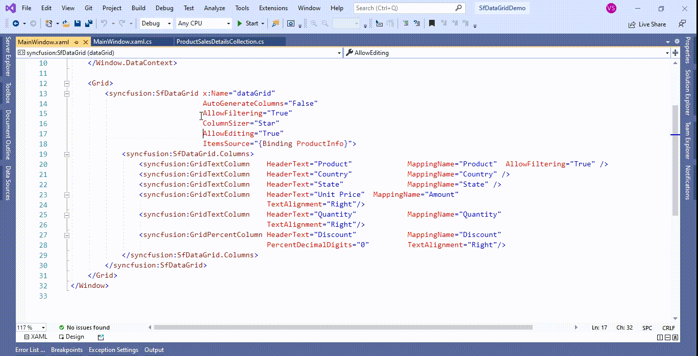
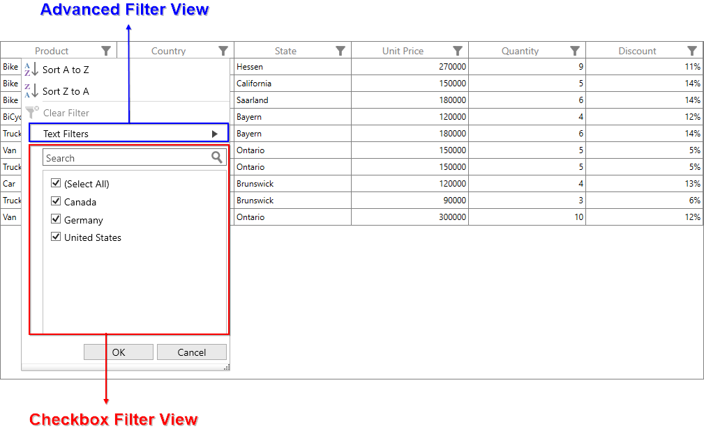
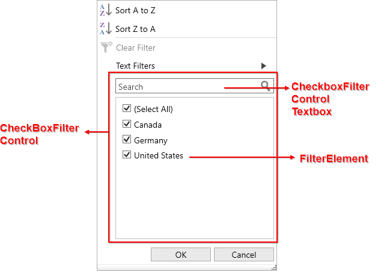
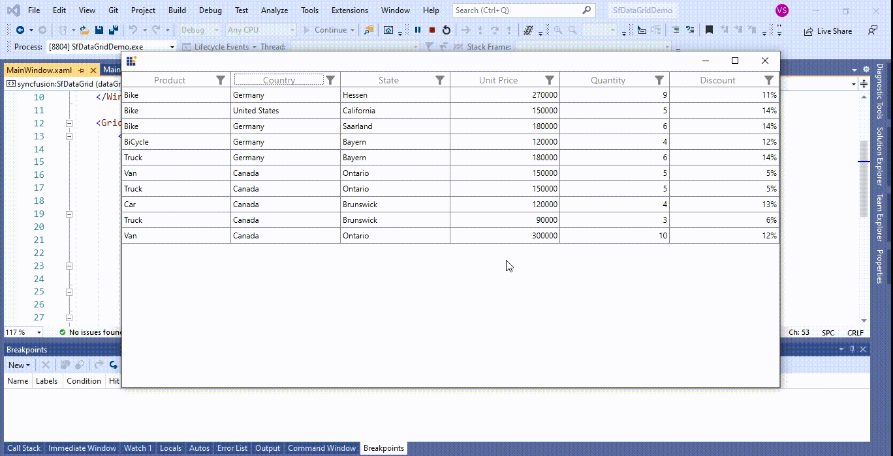
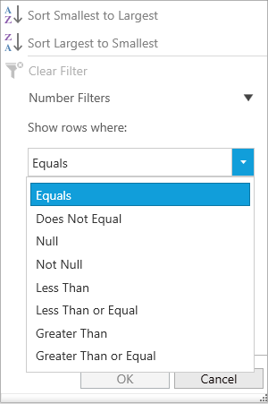
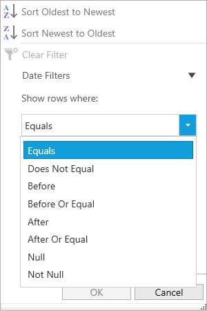
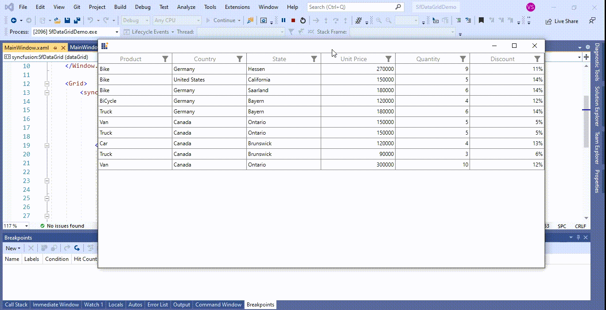

# How to Filter WPF DataGrid with Excel Like UI filtering?

## About the sample
This example illustrates how to filter the wpf datagrid like in Excel

[WPF DataGrid](https://www.syncfusion.com/wpf-controls/datagrid) (SfDataGrid) provides excel like filtering UI and also advanced filter UI to filter the data easily. UI filtering can be enabled by setting [SfDataGrid.AllowFiltering](https://help.syncfusion.com/cr/wpf/Syncfusion.UI.Xaml.Grid.SfDataGrid.html#Syncfusion_UI_Xaml_Grid_SfDataGrid_AllowFiltering) property to true , where you can open filter UI by clicking the Filter icon in column header and filter the records.

```XML

<syncfusion:SfDataGrid x:Name="dataGrid"    
                       AutoGenerateColumns="False"
                       AllowFiltering="True"
                       ColumnSizer="Star"
                       AllowEditing="True"
                       ItemsSource="{Binding ProductInfo}">

```

You can enable/disable filtering for particular column by setting [GridColumn.AllowFiltering](https://help.syncfusion.com/cr/wpf/Syncfusion.UI.Xaml.Grid.GridColumn.html#Syncfusion_UI_Xaml_Grid_GridColumn_AllowFiltering) property.

```XML

<syncfusion:GridTextColumn    HeaderText="Product" 
                              MappingName="Product"  
                              AllowFiltering="True"  />

```
## Note:
1. **GridColumn.AllowFiltering** has higher priority than **SfDataGrid.AllowFiltering** property.
2. UI filtering is not supported when using on-demand paging by setting [UseOnDemandPaging](https://help.syncfusion.com/cr/wpf/Syncfusion.UI.Xaml.Controls.DataPager.SfDataPager.html#Syncfusion_UI_Xaml_Controls_DataPager_SfDataPager_UseOnDemandPaging) to true.
   


## Built-in UI Views

DataGrid filter UI comprises of two different UIs.
        
•	**Checkbox Filter UI** - Provides excel like filter interface with list of check boxes.        
•	**Advanced Filter UI** - Provides advanced filter options to filter the data.

By default, both Checkbox Filter and Advanced Filter are loaded while opening the filter pop-up. You can switch between AdvancedFilter and CheckboxFilter by using AdvancedFilter button in the UI View.



## Checkbox Filter UI

In [CheckBoxFilterControl](https://help.syncfusion.com/cr/wpf/Syncfusion.UI.Xaml.Grid.CheckboxFilterControl.html) a list with checkboxes in show [FilterElement](https://help.syncfusion.com/cr/wpf/Syncfusion.UI.Xaml.Grid.FilterElement.html), you may need to filter out all data which the checkboxes are checked or filter out all data which the checkboxes are unchecked.

The following are the control parts of **Checkbox Filtering.**





## Advanced Filter UI

Advanced filter UI provides multiple filter options to filter the data easily. Filter menu options are loaded based on Advanced filter type by automatically detecting the underlying date type.

Below are the built-in filter types supported.

•	**Text Filters** – Loads various menu options to filter the display text effectively.

•	**Number Filters** – Loads various menu options to filter the numeric data.

•	**Date Filters** – Loads various menu options and [DatePicker](https://docs.microsoft.com/en-us/dotnet/api/system.windows.controls.datepicker?redirectedfrom=MSDN&view=net-5.0) to filter DateTime type column.

|   Text Filters       	|   Number Filters  | Date Filters        |
| ----------------------|-------------------|---------------------|
| When the string value is bounded to the [GridColumn](https://help.syncfusion.com/cr/wpf/Syncfusion.UI.Xaml.Grid.GridColumn.html) or the items source is [dynamic](https://docs.microsoft.com/en-us/dotnet/csharp/language-reference/builtin-types/reference-types) ,then **Text Filters** are loaded in [AdvancedFilterControl](https://help.syncfusion.com/cr/wpf/Syncfusion.UI.Xaml.Grid.AdvancedFilterControl.html).|  When integer, double, short, decimal, byte or long are bound to the **GridColumn** then Number Filters are loaded in **AdvancedFilterControl**. | When the DateTime type value is bound to the **GridColumn** , then Date Filters are loaded in **AdvancedFilterControl**. |
|   |   |   |
|  **Filter menu options** <br> 1.	Equals <br>2.	Does Not Equal <br>3.	Begins With <br>4.	Does Not Begin With <br>5.	Ends With <br>6.	Does Not End With <br>7.	Contains <br>8.	Does Not Contain <br>9.	Empty <br>10.	Not Empty <br>11.	Null <br>12.	Not Null <br> |  **Filter menu options** <br>1. Equals <br>2. Does Not Equal <br>3. Null <br>4. Not Null <br>5. Less Than <br>6. Less Than or Equal <br>7. Greater Than <br>8. Greater Than or Equal  | **Filter menu options**   <br> 1. Equals <br> 2.	Does Not Equal <br> 3.	Before <br> 4.	Before Or Equal <br> 5.	After <br> 6.	After Or Equal <br> 7.	Null <br> 8.	Not Null |

#### Note: 
1. Null and Not Null options are available only when [AllowBlankFilters](https://help.syncfusion.com/cr/wpf/Syncfusion.UI.Xaml.Grid.GridColumn.html#Syncfusion_UI_Xaml_Grid_GridColumn_AllowBlankFilters) is set to True.
2. If the column is [GridUnboundColumn](http://help.syncfusion.com/cr/wpf/Syncfusion.UI.Xaml.Grid.GridUnBoundColumn.html) or [GridMaskColumn](https://help.syncfusion.com/cr/wpf/Syncfusion.UI.Xaml.Grid.GridMaskColumn.html), then Text Filters will be loaded.



Take a moment to peruse the [WPF DataGrid - filtering](https://help.syncfusion.com/wpf/datagrid/filtering), where you can find about Filtering, with code examples.

## Requirements to run the demo
Visual Studio 2015 and above versions
